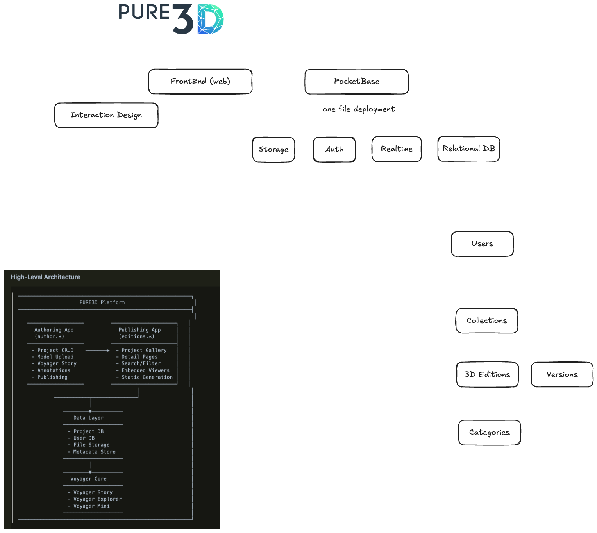

# Pure3D

A web platform for exploring 3D digital collections and editions in cultural heritage, built with modern web technologies.



## About

Pure3D provides an interactive way to view and explore 3D digitized artifacts, artworks, and cultural heritage objects. The platform features:

- Browse curated collections of 3D editions
- Interactive 3D viewing powered by Smithsonian Voyager
- Fast, seamless navigation between 3D models
- Responsive design for desktop and mobile

## Tech Stack

- **Frontend**: SvelteKit 2 + Svelte 5
- **Styling**: TailwindCSS 4 + DaisyUI
- **3D Viewer**: Smithsonian Voyager
- **Backend**: PocketBase
- **Runtime**: Bun

## Quick Start

1. **Clone and install**

```sh
git clone <your-repo-url>
cd pure3D
```

2. **Start development**
It will set up the frontend and Backend fully. If not set .env all values will be created by default.
```sh
docker compose up -d
```

This starts:
- Frontend at `http://localhost:8080`
- PocketBase at `http://localhost:8090`

3. **Setup PocketBase** (first run only)

Visit `http://localhost:8090/_/` to create your admin account, then import the database schema from
`pocketbase/pb_schema/collections.json`

# Features

### Pure3D Frontend
- [-] Fix scrollbar layout shift on navigation (added `scrollbar-gutter: stable`)
- [x] Optimize Voyager iframe loading with persistent iframe architecture
- [x] Add SvelteKit prefetching to all navigation links
- [x] Add Voyager background gradient for seamless loading


  - [ ] Add next/previous navigation on edition pages
  - [ ] Implement edition comparison view
  - [ ] Add keyboard shortcuts for navigation

### Pure3D Backend

### Installation scripts
- [x] Docker compose
- [ ] Automigration files on first run
- [ ]
- Docs
  - [ ] Docker Compose


## Resources

- [Smithsonian Voyager](https://smithsonian.github.io/dpo-voyager/)
- [SvelteKit](https://svelte.dev/docs/kit)
- [PocketBase](https://pocketbase.io/docs/)
- [TailwindCSS](https://tailwindcss.com/docs)
