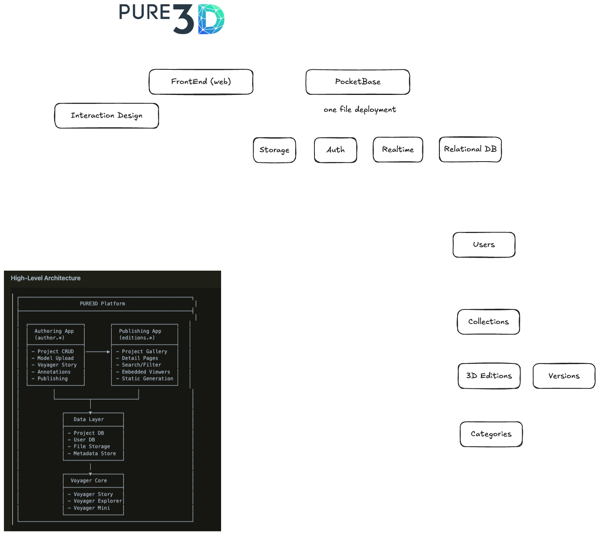

# Pure3D

[](https://opensource.org/licenses/Apache-2.0)
[](https://research-software-directory.org/projects/pure3d-20)


A web platform for exploring 3D digital collections and editions in cultural heritage, built with modern web technologies.



## About

Pure3D provides an interactive way to view and explore 3D digitized artifacts, artworks, and cultural heritage objects. The platform features:

- Browse curated collections of 3D editions
- Interactive 3D viewing powered by Smithsonian Voyager
- Fast, seamless navigation between 3D models
- Responsive design for desktop and mobile

## Tech Stack

- **Frontend**: SvelteKit 2 + Svelte 5
- **Styling**: TailwindCSS 4 + DaisyUI
- **3D Viewer**: Smithsonian Voyager
- **Backend**: PocketBase
- **Runtime**: Bun

## Quick Start

### Option A: Frontend only (recommended for most development)

No Docker, no database setup. The app connects to the production PocketBase and R2 assets by default.

```sh
git clone <your-repo-url>
cd pure3D-26
bun install
bun dev
```

Open `http://localhost:5173` and you're done. All data and 3D assets load from the production services automatically.

### Option B: Full local stack with Docker

Use this when you need a local PocketBase instance (e.g., to modify data, test schema changes, or work offline).

```sh
git clone <your-repo-url>
cd pure3D-26
cp .env.example .env
```

Before starting Docker, get the database seed data from a project maintainer and place it in `data/json-output/`. This data contains user records and is not included in the repository. Without it, the local database will be empty.

```sh
docker compose up
```

What happens on startup:

1. Starts a local PocketBase instance
2. Creates or upgrades the PocketBase schema automatically
3. Imports seed data from `data/json-output/` (if present)
4. Seeds demo login accounts
5. Starts the Vite dev server (with hot reload)

Open the app:

- Frontend: `http://localhost:8080`
- PocketBase admin UI: `http://localhost:8090/_/`

Demo accounts (created automatically):

- `admin@pure3d.eu` / `1234567890`
- `editor@pure3d.eu` / `1234567890`
- `viewer@pure3d.eu` / `1234567890`

To reset the local database:

```sh
docker compose down
rm -rf pocketbase/pb_data
docker compose up
```

## Data and Assets

### Default behavior (no configuration needed)

Out of the box, the app connects to production services:

| Service | URL | Purpose |
|---------|-----|---------|
| PocketBase | `https://pure3d-database.ctwhome.com` | Collections, editions, users |
| R2 CDN | `https://pure3d-assets.ctwhome.com` | 3D models, scenes, thumbnails |

No `.env` file, credentials, or local data are required for frontend development.

### Database seed data (Docker only)

The `data/` directory is git-ignored because it contains user information. It is only needed when running a local PocketBase with Docker Compose.

- `data/json-output/` - JSON files imported automatically by `docker compose up`
- `data/db/` - BSON source files for regenerating the JSON seed data

To regenerate JSON from BSON:

```sh
bun scripts/read-bson.ts
```

Ask a project maintainer for the seed data files if you need a local database.

### 3D assets

The 3D project assets (~7.5 GB) are served from a Cloudflare R2 bucket and are not included in the repository. The `static/project/` directory is git-ignored.

To override the default asset source, set `PUBLIC_ASSET_BASE_URL` in your `.env`:

- **Unset or URL** (default): loads from R2 CDN
- **Empty string** (`PUBLIC_ASSET_BASE_URL=`): serves from local `static/project/`

Local asset structure (for offline development):

```text
static/project/{collectionPubNum}/
├── icon.png
└── edition/{editionPubNum}/
    ├── scene.svx.json
    ├── icon.png
    ├── *.glb
    └── articles/
```

### Voyager runtime

The [Smithsonian Voyager](https://smithsonian.github.io/dpo-voyager/) 3D viewer is committed under `static/voyager/0.59.0/` (production-minified files only). It is served from the app's static folder in both development and on GitHub Pages.

## Deployment

The app deploys to **GitHub Pages** as a static site. Pushing to `main` triggers an automatic deploy via the GitHub Actions workflow (`.github/workflows/deploy.yml`).

Build environment:

```env
APP_BASE_PATH=/pure3d
PUBLIC_POCKETBASE_URL=https://pure3d-database.ctwhome.com
PUBLIC_ASSET_BASE_URL=https://pure3d-assets.ctwhome.com
```

# Features

### Pure3D Frontend
- [-] Fix scrollbar layout shift on navigation (added `scrollbar-gutter: stable`)
- [x] Optimize Voyager iframe loading with persistent iframe architecture
- [x] Add SvelteKit prefetching to all navigation links
- [x] Add Voyager background gradient for seamless loading


  - [ ] Add next/previous navigation on edition pages
  - [ ] Implement edition comparison view
  - [ ] Add keyboard shortcuts for navigation

### Pure3D Backend

### Installation scripts
- [x] Docker compose
- [ ] Automigration files on first run
- [ ]
- Docs
  - [ ] Docker Compose


## Versioning & Releases

This project uses tag-triggered releases with automatic changelog generation.

### How It Works

- Version comes from git tags (e.g., `v0.3.0`)
- Pushing a tag triggers GitHub Actions to generate a changelog and create a GitHub Release
- Dev server shows your exact git state via `git describe --tags`

### Version Display

| Environment  | Example             | Meaning                                   |
|-------------|---------------------|-------------------------------------------|
| On a tag    | `v0.3.0`            | Exactly at release v0.3.0                 |
| After commits | `v0.3.0-5-ga1b2c3d` | 5 commits after v0.3.0, at commit a1b2c3d |

### Creating a Release

```sh
# Work with conventional commits
git commit -m "feat: add new feature"
git commit -m "fix: resolve bug"
git push origin main

# When ready to release
git tag v0.4.0
git push --tags
```

### Conventional Commits

| Prefix | Category        |
|--------|-----------------|
| feat:  | Features        |
| fix:   | Bug Fixes       |
| docs:  | Documentation   |
| chore: | Maintenance     |
| feat!: | Breaking Changes|

## Resources

- [Smithsonian Voyager](https://smithsonian.github.io/dpo-voyager/)
- [SvelteKit](https://svelte.dev/docs/kit)
- [PocketBase](https://pocketbase.io/docs/)
- [TailwindCSS](https://tailwindcss.com/docs)
